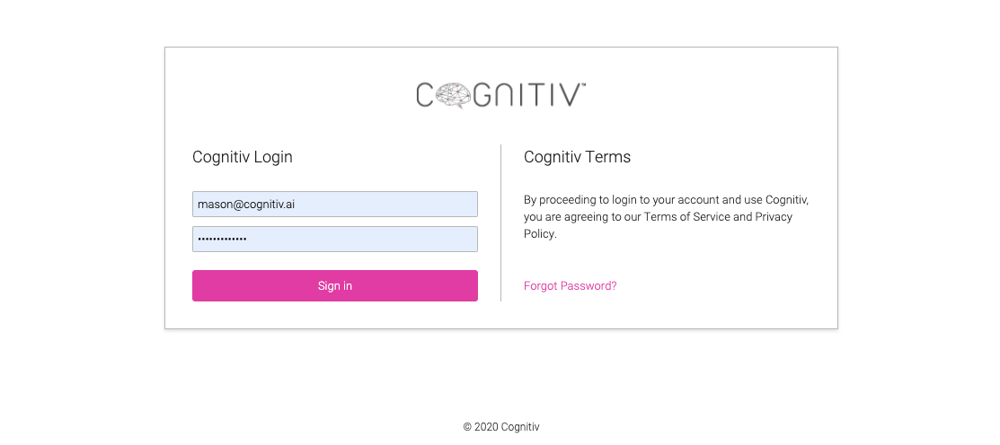

## Cognitiv React Redux Challenge

Fork the repo into your GitHub Account. Pull the repo locally and run 'yarn' to install the node modules. I recommend using Visual Studio Code if you dont already use it and install Beautify and ESLint extensions.

### Cognitiv Directions

After the node modules have been installed run the command 'npm start'. You will be building a psuedo login screen, navigation and a dashboard page. You will also be hooking up some basic Redux actions as well as a reusable input component. There will be no redline or design guidelines so make it as accurate as possible from the images.

### Login Page

Build the login page as accurately as possible. We are looking at the design as well as the code and how you manage coding patterns. 

For the login button use the Button component located in the components directory. This will help guide you on the location for other reusable components for this mini project.

Make a reusable Input component that will allow a user to input text or a password. Have the input style look like the inputs in the image. Do not use a library for these inputs. Please develop the css from scratch along with the necessary props.

The Forgot Password link can be static and not do anything.

When a user clicks the 'Sign In' button:
- Activate the loading spinner with Redux
- Wait 3 seconds
- Set the user with Redux
- Deactivate the loading action with Redux

To make this action happen you will need to create a user reducer in the ducks folder. The key to authenticate a user will be to pass an arbitrary authentication key to the user reducer.

